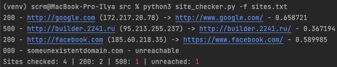

# Python CLI site checker

## Information

### Description

This program with CLI-interface will help webmasters, system administrators and programmers check the functionality of the list of migrated sites.

Imagine a situation: you need to **transfer 100+ websites** from one hosting to another, and then check their performance. Manually checking such a number of sites can take a very long time. With this program, you just need to list the necessary sites in a file, launch it and go drink coffee ☕

### Features

- 🕑 **Saves time:** the program will check for you all the URLs that you specify to it and report their availability.
- 🪄 **Easy to use:** via a Cli interface, similar to any default Linux program.
- 🌴 **Without exotic libraries:** for the program to work, only one library is needed: `requests` (and related to it).


### Requirements

* Python 3.6+

### Author

Ilya Malashenko (github: melax08, telegram: @ScreamOFF)

## Documentation

### Installation

Clone the repository and go to the root directory with the program:
```shell
git clone https://github.com/melax08/site_checker.git && cd site_checker
```

Create `python` virtual environment and activate it:
```shell
python3 -m venv venv && source venv/bin/activate
```

Install requirements from the `requirements.txt` file:
```shell
python3 -m pip install --upgrade pip && pip install -r requirements.txt
```

Fill the `sites.txt` file with a list of URLs that require accessibility checking. You can also select a different site list file or specify a site list interactively. More details in the section <a href="#How-to-use">How to use</a>.
```text
example.com
example2.com
example3.com
```

### How to use

Go to the source directory and run the main program with the key `--help` 

```shell
cd src
```

```shell
python3 site_checker.py --help
```

In `help` you can see the whole list of application options.

### Keys

`-s` or `--sleep` - pause time in seconds between requests to specified sites. Default: 1 second. This setting is needed in order not to bring down a barrage of web requests on your server or hosting, in order to avoid HTTP flooding.

`-f` or `--file` - path to a file with a list of URLs to check. Default: `sites.txt` in directory with application (`site_checker/src/sites.txt`).

`-ua` or `--user-agent` - allows you to set your own value for the `User-Agent` request header. Default: `melax08 Site Checker v*`

`-l` or `--list` - allows you to specify a list of sites to check directly in this argument. When using this argument, the `--file` argument will not work.

`-v` or `--verify` - verifies SSL certificates for HTTPS requests just like a web browser. By default, ignore verifying the SSL certificate.

### Usage examples



Simple usage with default arguments.
```shell
python3 site_checker.py
```

Specify the path to your file with a list of URLs (`-f`), with a pause of 5 seconds between checks (`-s`) and custom User-Agent request header (`-ua`).

```shell
python3 site_checker.py -f /path/to/some/file.txt -s 5 -ua "My custom user-agent"
```

Check the list of sites specified after `-l` argument:

```shell
python3 site_checker.py -l example.com facebook.com google.com
```

### Additional settings
You can also change some settings of the script in `constants.py` file.
Here is a description of some settings:

`REQUEST_TIMEOUT` - request timeout specified in seconds. Default: 10.


### Roadmap

- [x] Create MVP of CLI application.
- [ ] Add interactive mode.
- [ ] Analysis of requests with errors.
- [ ] Ability to specify IP for sites (as in the `/etc/hosts` file).